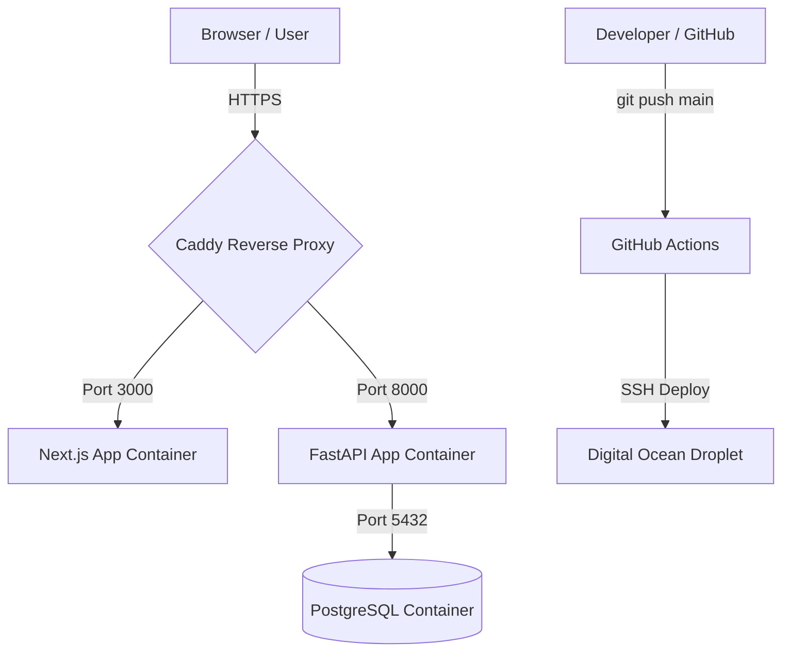

# LuxeShake — Premium Ordering & Management System

LuxeShake is a premium, full-stack web application for ordering custom shakes, apothecary blends, and managing delivery logistics. It features a beautiful, luxurious dark-gold themed client portal and a comprehensive internal administration dashboard (**LuxeControl**).

---

## System Architecture

The application is fully containerized and orchestrated using **Docker Compose**. It is deployed on a **Digital Ocean Droplet** and uses **Caddy** as a reverse proxy with automated SSL (Let's Encrypt).



### Tech Stack
*   **Frontend:** Next.js (App Router, TypeScript, Zustand, TailwindCSS / Vanilla CSS styling)
*   **Backend:** FastAPI (Python 3.12, Poetry, SQLAlchemy 2.0, Pydantic v2, PostgreSQL)
*   **Reverse Proxy & SSL:** Caddy Server
*   **Containers:** Docker & Docker Compose
*   **Deployment:** GitHub Actions CI/CD pipeline
*   **Hosting:** Digital Ocean Droplet (Ubuntu)

---

## Folder Structure

```
luxeshake/
├── backend/               # FastAPI application code & configs
│   ├── app/               # Core application logic (models, routers, schemas)
│   ├── uploads/           # Local storage directory for uploaded product images
│   ├── Dockerfile         # Docker container configuration for backend
│   └── README.md          # Backend documentation
├── frontend/              # Next.js client & admin portal
│   ├── src/               # UI components, state stores, and page routes
│   ├── Dockerfile         # Multi-stage Docker container build for frontend
│   └── README.md          # Frontend documentation
├── .github/workflows/     # GitHub Actions CI/CD workflows
│   └── deploy.yml         # Automated deployment script
├── docker-compose.yml     # Container orchestration definition
├── Caddyfile              # Routing and automatic SSL mapping rules
├── .env                   # Local development environment configuration
└── .env-prod              # Production environment configurations (Git ignored)
```

---

## Production Deployment & Hosting (Digital Ocean)

The project is hosted on a Digital Ocean Droplet. Updates are automated via **GitHub Actions** defined in [deploy.yml](file:///.github/workflows/deploy.yml).

### Automated CI/CD Deployment
1.  When changes are pushed to the `main` branch, the GitHub Action triggers.
2.  It logs into the Droplet securely using SSH (`HOST`, `USERNAME`, `SSH_PRIVATE_KEY` secrets).
3.  It pulls the latest changes from the GitHub repository.
4.  It runs:
    ```bash
    docker compose up -d --build
    ```
    This rebuilds any updated containers and applies the new configurations instantly with minimal downtime.

### SSL & Caddyfile Configurations
Caddy serves the frontend and backend on custom domains, automatically requesting and renewing Let's Encrypt certificates.
Refer to [Caddyfile](file:///Caddyfile) for routing definitions.

---

## Accessing the Database (pgAdmin & SSH Tunneling)

For security, the PostgreSQL database port (`5432`) is not exposed publicly to the internet. To connect to the production database via pgAdmin from your local machine, you must route your connection through an **SSH Tunnel**:

1.  **Configure pgAdmin Connection:**
    *   **Host:** `127.0.0.1` (relative to the Droplet)
    *   **Port:** `5432`
    *   **Username / Password:** (Values defined in your `.env-prod` file under `POSTGRES_USER` and `POSTGRES_PASSWORD`)

2.  **Enable SSH Tunneling tab in pgAdmin:**
    *   **Use SSH Tunneling:** Yes
    *   **Tunnel Host:** Your Droplet IP Address
    *   **Port:** `22`
    *   **Username:** `root` (or your SSH user)
    *   **Authentication:** *Identity File* (select your private SSH key file)

---

## Local Development Setup

To run the full stack locally:

1.  Clone the repository.
2.  Set up the local environment file `.env` in the root folder.
3.  Refer to the respective README files:
    *   [Backend Setup Guide](file:///backend/README.md)
    *   [Frontend Setup Guide](file:///frontend/README.md)
